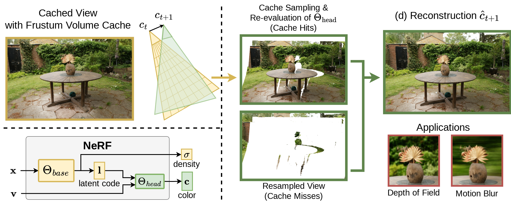

# Frustum Volume Caching for Accelerated NeRF Rendering - Training Framework

This project contains the NeRF training framework, discussed in the HPG 2024 paper "Frustum Volume Caching for Accelerated NeRF Rendering".



It contains a pytorch training framework for [Instant-NGP](https://github.com/NVlabs/instant-ngp) models, based on [Nerfacc](https://github.com/nerfstudio-project/nerfacc/tree/master/nerfacc).
Additionally, it enables training models with our proposed view-dependent cone encoding and z-linearity, as well as other components discussed in the paper.

# Setup

Clone the repository:

```
git clone https://github.com/steimich96/FrustumVolumeCaching-training.git --recursive
```

Create Conda environment

```
conda create --name yanf -y python=3.10
conda activate yanf
pip install setuptools==69.5.1
```

Install PyTorch with CUDA 11.8 and tiny-cuda-nn

```
pip install torch==2.0.1+cu118 torchvision==0.15.2+cu118 --extra-index-url https://download.pytorch.org/whl/cu118

conda install -c "nvidia/label/cuda-11.8.0" cuda-toolkit
pip install ninja git+https://github.com/NVlabs/tiny-cuda-nn/#subdirectory=bindings/torch
pip install -r requirements.txt
```

# Running

The source code was tested on Ubuntu 22.04 with an NVIDIA RTX 4090.

Our framework can currently only train on scenes of the [MipNerf-360 dataset](ttps://jonbarron.info/mipnerf360/), using the data loaders of Nerfacc. You can download the dataset from their website.

Training is performed by running the `train.py` script.
We provide command line arguments that correspond to our used models in the paper in `train_and_eval_all.sh`.
You will have to set the `MIP360_DATA_ROOT` variable in this script to the location of the dataset.
Note that training with our view-dependent cone encoding and z-linearity leads to large memory requirements. We recommend at least 12 GB of VRAM.

The `eval.py` script performs evaluation using standard image metrics, and performs the view-consistency evaluation for the view-dependent cone encoding, as discussed in Supplemental "D".
This scripts is directly executed after training when using the `train_and_eval_all.sh` shell script.

# Troubleshooting

"Cannot find `-lcudart`". Can be solved by creating a symbolic link to the "lib" directory inside the conda environment, as it seems to be looking for libraries in "lib64":

```
ln -s <path_to_conda>/envs/yanf/lib <path_to_conda>/envs/yanf/lib64
```